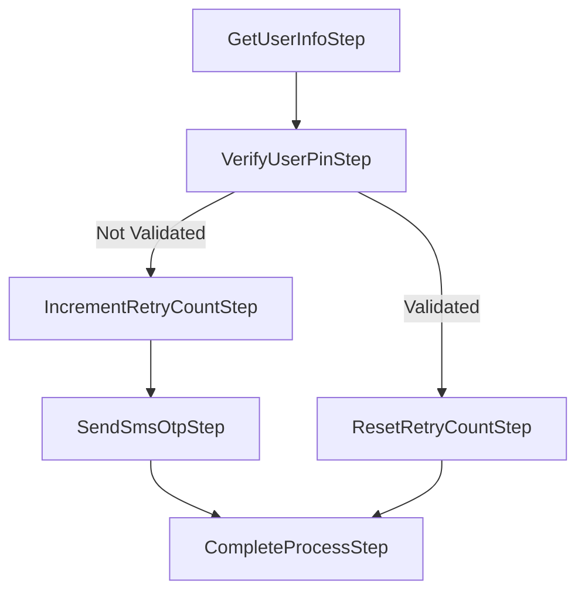

# RoseLine


[](https://www.nuget.org/packages/RoseLine)
[](https://www.nuget.org/packages/RoseLine)

<a href="https://www.instagram.com/caglargul.52/">
    </a> &nbsp; <a href="https://www.linkedin.com/in/caglargul52/">
    </a> &nbsp;  <a href="https://medium.com/caglargul-blog">
    </a>

**RoseLine** is a flexible and customizable pipeline framework designed to process steps sequentially. Each step can handle errors gracefully and continue based on predefined conditions.

## Why RoseLine? 
In many applications, there is a need to process data or execute tasks step by step. However, handling errors, managing data, and ensuring that each step behaves as expected can be cumbersome. **RoseLine** simplifies this by providing: 
- A structured way to define steps. 
- Error handling at each step, with the ability to continue or stop processing based on conditions. 
- Data that flows through the pipeline and can be modified by each step. 
- Asynchronous step processing for modern application needs.

## Key Concepts 
- **Pipeline**: A series of steps executed sequentially, where each step can modify the data or handle errors. 
- **Steps**: Units of work that are executed by the pipeline. Each step can process data and handle errors. 
- **Data Bags**: Objects that hold the data being processed through the pipeline. These inherit from the base class `BagBase`. 
- **Error Handling**: Each step can define custom errors that will be handled by the pipeline.

## Installation

```bash
dotnet add package RoseLine
```
## Usage
### 1. Define a Bag Class
Bags are designed to be ***record*** based. This prevents unintentional modification of data when moving data between pipeline steps. In these steps, the data is copied at each step to create new data, thus keeping the data moved in the previous steps safe.
```csharp
public record ExampleBag : BagBase
{
    public string Data { get; set; }
}
```
### 2. Define a Custom Error Class (Optional)
You can catch errors in the pipeline with error classes that you create yourself. This is optional. By default, an error of type StepError is returned. To define a custom Error class, you must derive it from the StepError class.

**StepError** class has two important properties. 
- ***IsUnhandledError*** : This is set to true if an unhandled error occurs in the pipeline.
- ***Step*** : Gives the step at which the error occurs.

```csharp
public class CustomError : StepError
{
    public string Code { get; set; }
    public int Severity { get; set; }
}
```
### 3. Define a Step
A step is implemented by deriving from the StepBase class. There are two different derivation methods. StepBase<TBag> and StepBase <TBag, TError>.

If the default Error class will be used in the step, ***StepBase<TBag>***  is used. ***TBag*** here stands for Bag class type (Default: StepError class)

If a custom error class is to be used, ***StepBase <TBag, TError>*** is used. ***TError*** here refers to the Custom error type.

There are some special methods to be used in step. These are
- ***ThrowStepError*** : It is used to throw processed errors.
- ***Next*** : Used to move to the next step with the current bag object.
- ***Stop*** : It can be requested that the process should not continue according to some business in the step. Therefore Stop can be used.

Both uses are available below.
```csharp
public class GetAllUserStep : StepBase<ExampleBag>
{
  protected override async Task<ExampleBag> ProcessAsync(ExampleBag input)
  {
    var users = GetFakeUsers();

    if (!users.Any()) {
      return ThrowStepError(new StepError { Message = "Users is not found!" });
    }

    var output = input with { Users = users };

    return Next(output);
  }

  private List<string> GetFakeUsers()
  {
    return new List<string> { "Çağlar", "Osman", "Ismail" };
  }
}
```

```csharp
public class GetAllUserStep : StepBase<ExampleBag, CustomError>
{
  protected override async Task<ExampleBag> ProcessAsync(ExampleBag input)
  {
    var users = GetFakeUsers();

    if (!users.Any()) {
      return ThrowStepError(new CustomError { Message = "Users is not found!",
                                              Code = "A1",
                                              Severity = 1 });
    }

    var output = input with { Users = users };

    return Next(output);
  }

  private List<string> GetFakeUsers()
  {
    return new List<string> { "Çağlar", "Osman", "Ismail" };
  }
}
```
> **NOTE**
> It is quite simple to create a copy of a record with the ***with statement*** and modify only certain fields. This allows one step in the pipeline to create a new version of the data after modifying it and then move on to the next step.

### 4. Define a Step with Dependency Injection (DI)
```csharp
public class GetAllUserStep : StepBase<ExampleBag>
{
  private readonly IUserService _userService;

  // We inject services via constructor
  public GetAllUserStep(IUserService userService)
  {
    _userService = userService;
  }

  protected override async Task<ExampleBag> ProcessAsync(ExampleBag input)
  {
    // Retrieving users using injected service
    var users = _userService.GetUsers();

    var output = input with { Users = users };

    return Next(output);
  }
}
```
### 5. Create and Execute the Pipeline
```csharp
class Program
{
  static async Task Main(string[] args)
  {
    // initial bag definiton
    var bag = new ExampleBag { Users = [] };

    var pipeline = new Pipeline<ExampleBag, CustomError>(bag);

    pipeline.AddStep(new GetAllUserStep());
    pipeline.AddStep(new DeleteFirstUserStep());

    var pipelineResult = await pipeline.ExecuteAsync();

    if (pipelineResult.IsSuccess) {
      Console.WriteLine(string.Join(",", pipelineResult.Bag.Users));
    } else {
      Console.WriteLine(
        $"Step: {pipelineResult.Error.Step}, IsUnHandledError: {pipelineResult.Error.IsUnhandledError}, Code: {pipelineResult.Error.Code}");
    }
  }
}
```
Output: 
```bash
Osman,Ismail
```
### 6. Branching Pipeline and Continuation in Stages
This pipeline showcases a conditional workflow where different actions are taken based on whether the user’s PIN validation succeeds or fails. It helps to manage different paths in authentication or other validation scenarios, allowing for greater flexibility in handling user processes. This branching design enables the system to adapt based on user input or conditions encountered during processing.

```csharp
class Program
{
  static async Task Main(string[] args)
  {
    // initial bag definiton

    var bag = new ExampleBag { Users = [], IsPinVerified = false };

    var pipeline = new Pipeline<ExampleBag, CustomError>(bag);

    pipeline.AddStep(new GetUserInfoStep());
    pipeline.AddStep(new VerifyUserPinStep());

    var halfResult = await pipeline.ExecuteAsync();

    if (!halfResult.IsSuccess) {
      Console.WriteLine(
        $"Step: {halfResult.Error.Step}, IsUnHandledError: {halfResult.Error.IsUnhandledError}, Code: {halfResult.Error.Code}");
      return;
    }

    if (!halfResult.Bag.IsPinVerified) {
      pipeline.AddStep(new IncrementRetryCountStep());
      pipeline.AddStep(new SendSmsOtpStep());
    } else {
      pipeline.AddStep(new ResetRetryCountStep());
    }

    pipeline.AddStep(new CompleteProcessStep());

    var result = await pipeline.ExecuteAsync();

    if (!result.IsSuccess) {
      Console.WriteLine(
        $"Step: {result.Error.Step}, IsUnHandledError: {result.Error.IsUnhandledError}, Code: {result.Error.Code}");
      return;
    }

    Console.WriteLine(string.Join(",", result.Bag.Users));

    Console.Read();
  }
}
```
> **NOTE**
> In this example, the pipeline processing is designed to execute in multiple stages, with the ability to resume from where it left off. This is a critical design feature, as it allows you to execute part of the pipeline, make decisions based on intermediate results, and continue the process without restarting from the beginning.

## Support

If you are having problems, please let me know by [raising a new issue](https://github.com/caglargul52/rose-pipe/issues/new/choose).
